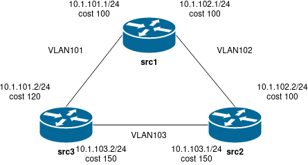

# Лабораторная работа 24.

## Цели работы

Настройка OSPF.

## Задачи

1. Поднять три виртуалки.
2. Объединить их разными vlan.
3. Поднять OSPF между машинами на базе Quagga.
4. Изобразить ассиметричный роутинг.
5. Сделать один из линков "дорогим", но что бы при этом роутинг был симметричным.

---

## Выполнение

Файлы представлены в каталоге [cfg](./cfg).

---
