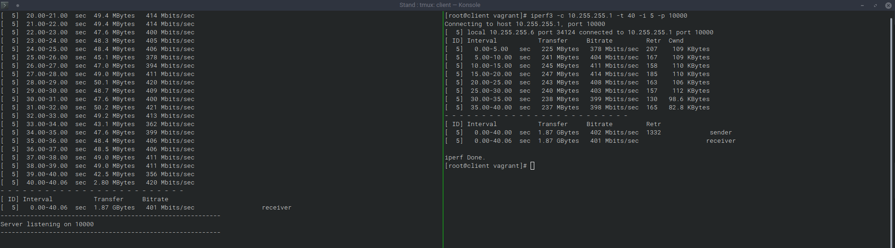

# Лабораторная работа 25.

## Цели работы

Настройка VPN.

## Задачи

1. Между двумя виртуалками поднять vpn в режимах:
- tun
- tap

2. Описать в чём разница, замерить скорость между виртуальными машинами в
туннелях, сделать вывод об отличающихся показателях скорости.
3. Поднять RAS на базе OpenVPN с клиентскими сертификатами,
подключиться с локальной машины на виртуалку.

---

## Выполнение

Файлы представлены в каталоге [cfg](./cfg). 

Для тестирования подключения между ВМ необходимо использовать файлы `tun.ovpn` и `tap.ovpn`, расположенные на ВМ `client` в директории `/home/vagrant`.

Для тестирования подключения с хостовой машины можно использовать файл [client2.ovpn](./cfg/files/client2.ovpn), скорректировав адрес подключения.

Разница между TUN и TAP: TAP работает на L2, TUN - на L3. Различия по скорости представлены на скриншотах ниже:

1. TAP

2. TUN

Исходя из информации выше, можем сделать вывод о том, что TUN интерфейс быстрее по сравнению с TAP.

---
