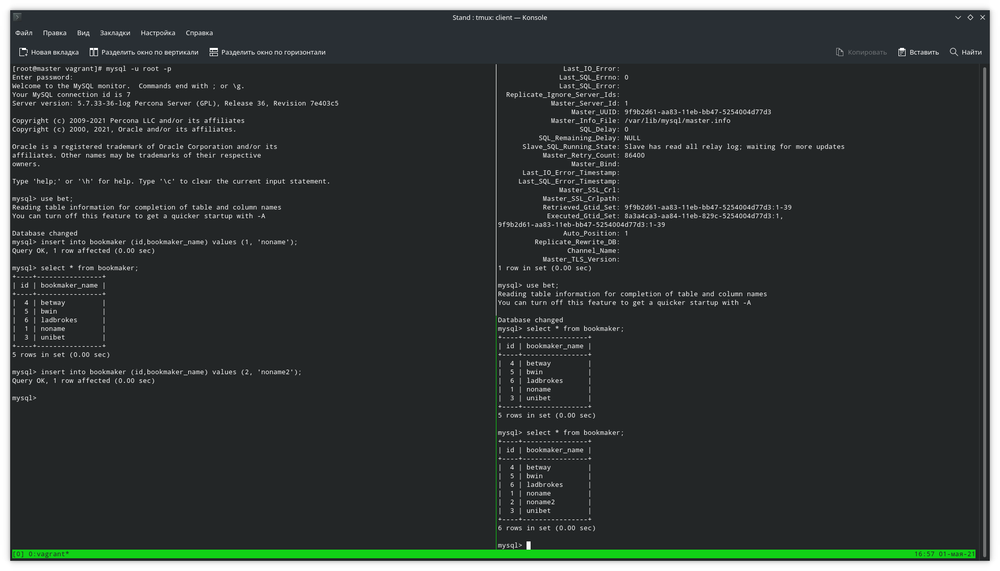

# Лабораторная работа 27.

## Цели работы

MySQL.

## Задачи

В материалах приложены ссылки на вагрант для репликации и дамп базы bet.dmp Базу развернуть на мастере и настроить так, чтобы реплицировались таблицы:

| bookmaker | competition | market | odds | outcome |

Настроить GTID репликацию x варианты которые принимаются к сдаче

рабочий вагрантафайл

скрины или логи SHOW TABLES

конфиги

пример в логе изменения строки и появления строки на реплике

---

## Выполнение

Файлы представлены в каталоге [cfg](./cfg).

Скриншот выполнения реплики (в левой части отображены 2 добавления в таблицу на мастере, справа - два запроса на отображение строк на слейве):

---
