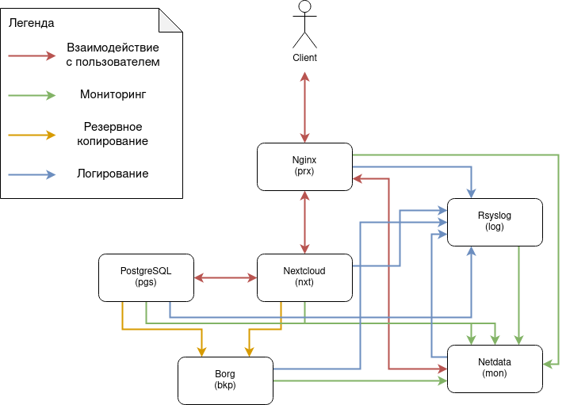

# Проектная работа

# Автоматизированное развертывание системы облачного хранения данных Nextcloud

## Описание работы

В рамках данной работы была проведена подготовка инфраструктуры согласно схеме ниже:

Пользователю доступны следующие ресурсы:

1. Файловое хранилище: [localhost:8443](https://localhost:8443)
2. Мониторинг: [localhost:8444](https://localhost:8444)

### Базовая информация

Для размещения виртуальных машин в данной работе используется Virtualbox, в качестве базовой ОС используется CentOS 8 1905.1. Для развертывания и провиженинга виртуальных машин применяются Vagrant и Ansible, также используется Podman для развертывания Nextcloud и базы данных.

Все ВМ расположены в пределах подсети 192.168.50.0/28 с небольшим резервированием по доступным адресам.

Сенситивная информация расположена в файле secrets.yml, зашифрованном с помощью ansible vault (пароль находится в файле [vault_pass](./vault_pass)). Часть данных (архив с сертификатами, приватный ключ) зашифрованы отдельно, без внесения в файл, с помощью того же ansible vault и того же пароля. При развертывании дополнительных действий не требуется, все подтягивается автоматически.

### Облачное хранилище и БД

В качестве основного сервиса в данной инфраструктуре выступает сервис Nextcloud 21 (цифра зависит от даты запуска, т.к. применяется latest image) - облачная среда для обеспечения совместного доступа и работы с файлами. В качестве базы данных для сервиса используется PostgreSQL 11.

Дополнительно в ходе развертывания Nextcloud используется python-скрипт, который выполняет доконфигурацию после завершения мастера первоначальной настройки. Вызвано это тем, что для корректной работы реверс-прокси и Nextcloud в целом, необходимо внести правки в конфигурационный файл Nextcloud, указав корректные значения на перезапись (изначально там не хватает порта, на котором слушает Nginx, что, в свою очередь, вызывает некорректное обращение браузера к хостовому порту :80).

### Proxy-сервер

Точкой входа для пользователя является Nginx сервер, отвечающий на портах 8443 (Nextcloud) и 8444 (Netdata) хостовой машины. Для обеспечения шифрования используются самоподписанные сертификаты.

### Логирование

Для логирования используется RSysLog, логи отправляются на отдельно взятый сервер `log` и расположены в каталоге `/var/log/recieved`.

### Мониторинг

В качестве системы мониторинга используется Netdata. В данной работе задействуются базовые метрики и встроенные нотификации. В качестве каналов оповещения: всплывающие сообщения в браузере и отображение на вкладке Alerts системы мониторинга для каждого конкретного хоста.

Контейнеры и базовые метрики подхватываются автоматически.

Для PostgreSQL и Nextcloud используются дополнительные плагины, разделы Postgresql tcp и nextcloud local для окон мониторинга pgs и nxt соответственно.

Дополнительные метрики также снимаются с Nginx (графа nginx local в окне prx)

### Резервное копирование

Для целей резервного копирования используется Borgbackup, в данной работе выполняются резервные копии БД и файлов облачного хранилища с сохранением на отдельный сервер. Копирование выполняется раз в сутки (в полночь), производятся резервные копии пользовательских данных из Nextcloud, а также снимается дамп базы PostgreSQL.

Т.к. подготовка файлов и их отправка выполняются двумя разными пользователями (а потому и двумя разными скриптами), предусмотрена блокировка через создание файла, тем самым, если подготовка файлов затянется и скрипт на отправку начнет работу, то последний будет ожидать снятия блокировки и только после этого начнет активные действия по резервному копированию.

Досрочно работу резервного копирования можно проверить с хостов `pgs` и `nxt`, перейдя в каталог `/opt/borg` и выполнив от рута последовательность: 

`./create.sh; su borg ./send.sh`.

## Порядок запуска

1. Запустить Vagrantfile командой `vagrant up`.
2. При получении запроса на действие от пользователя (шаг `User action is needed`):
    - Перейти по указанному в сообщении адресу
        > Таймаут на выполнение перехода: 150 минут.
    - Ввести логин и пароль учетной записи администратора 
        > Данные логин и пароль далее не будут использоваться в развертывании, поэтому можно указать любые значения. 
    
    Плейбук продолжит работу, в браузере появится ошибка доступа по таймауту (см. п. 4 раздела **Известные проблемы**).
3. По окончанию работы скриптов проверить доступность [хранилища](https://localhost:8443) и [мониторинга](https://localhost:8444).

## Известные проблемы

| N | Описание | Решение |
| :--: | :-- | :-- |
| 1 | `fatal: [<MACHINE>]: FAILED! => {"changed": false, "msg": "FileNotFoundError: [Errno 2] No such file or directory\n"}` | Запустить вагрант-файл снова, с указанием перепровиженинга существующих машин (или только одной конкретной, на которой была получена указанная ошибка) |
| 2 | Netdata может не подтягивать плагины | Необходимо произвести перезагрузку сервиса netdata на проблемной машине. Частично это решено тем, что перезагрузка мониторинга выполняется глобально в конце деплоя |
| 3 | Bad request со стороны Nginx при переходе в сервис после запроса на выполнение действий пользователем и после выполнения этих действий | Несмотря на то, что вокруг запуска сервиса расставлены многочисленные таймауты, заданного времени может не хватить на развертывание приложения внутри контейнера и отработку скрипта. В связи с чем имеет смысл обновить страницу через пару минут
| 4 | Ошибка установки соединения с Nextcloud после создания учетной записи администратора | Nextcloud по умолчанию считает что он выполняется на том же хосте, на котором его настраивают, потому встроенный веб-сервер перетирает значения в адресной строке на `http://localhost`. В нашем случае это не совсем ожидаемое поведение, т.к. proxy-сервер ожидает соединение на порту 8444 для данного сервиса. Исправляется в ходе развертывания самостоятельно (т.к. необходимый конфиг подъезжает также после завершения работы мастера первого запуска). |
| 5 | Долгая установка Podman | `¯\_(ツ)_/¯` |
